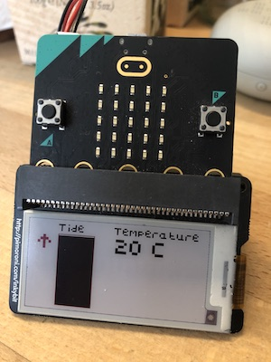

# microbit-simple-tides
A very simple tide clock for the BBC micro:bit and Pimoroni inky:bit eInk display

## What is it?
A toy to give a rough guide to whether tides in your location are rising or falling and very roughly how long it will be until the tide turns.

It uses a very simple algorithm and assumes there is always 6 hour 12.5 minutes between turns of the tide, so its accuracy will vary.

It updates the display every 10 minutes.

It only works with a micro:bit V2 and the Pimoroni inky:bit eInk display - which is no longer made.

## How do you set it up?
- Edit the code so the `ticks` variable is set to the number of hours and minutes until the next tide change at your location.
- Set the `rising` variable to `true` if the tide is coming in currently, set it to `false` if the tide is going out.
- Flash the HEX file to your micro:bit
- Don't press the reset button!

## Next steps
- Add estimate of how long until next tide changes
- Add other ways of setting the tide time, perhaps by radio (the LED display is disabled with this accessory).
- Make a version that just uses the LED display, pressing a button to light up the display to save battery power.

## Code blocks

